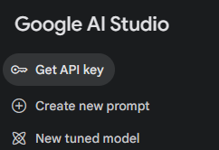
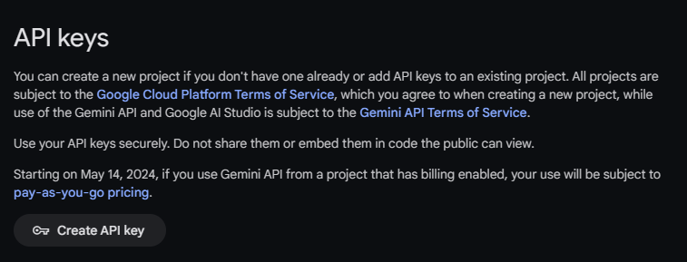
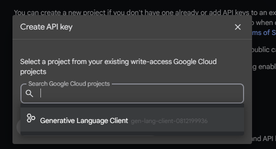

# Chatbot Imersivo

Explore o mundo natural com nosso chatbot imersivo, desenvolvido com o Google Gemini. Faça perguntas sobre meio ambiente, vida selvagem e conservação e obtenha respostas abrangentes baseadas em dados especializados. Descubra a beleza e a complexidade da natureza de uma maneira envolvente e interativa. Deixe o chatbot ser seu guia para uma jornada de conhecimento e apreciação pelo mundo que nos rodeia.

## Detalhes técnicos do projeto

* Node na versão 20;
* Gerenciador de pacotes `pnpm`;
* Projeto React com `Typescript` como principal linguagem;
* Projeto React criado por meio do vite.
* Para rodar o projeto, abra o prompt de comando e digite `pnpm dev` ou `pnpm run` com o gerenciador de pacotes já instalado e configurado

>O gerenciado de pacotes `pnpm` geralmente roda a aplicação na porta 5173: [http://localhost:5173/]( http://localhost:5173/)

### Dependências

* Google generativeAI: `pnpm install @google/generative-ai`
* MaterialUI: `pnpm add @mui/material @emotion/react @emotion/styled`

## Aplicação

Para usar a aplicação, tenha em mãos a chave da API do germini. Para conseguir obter uma, siga o passo a passo a seguir:

1. Acessar o site do [Google AI Studio](https://aistudio.google.com/app/prompts/new_chat/?utm_source=website&utm_medium=referral&utm_campaign=Alura&utm_content=)
2. ir em "Get API key" localizado no canto superior esquerdo, como ilustado na imagemabaixo;

    

3. Clique em "Create API Key", como ilustrado na imagem;

  

4. Clique no campo de busca e selecione o "Generative Language Client", como ilustrado na imagem;

  

5. Copie a chave de acesso e a use para acessar a API da AI Germini.

Agora, com a chave de acesso em "mãos", use no único campo para acessar a aplicação. Note que é um campo obrigatório e que a chave deve ser válida. Caso dê algum erro na comunicação com o servidor, a interface deve mostrar.

> versão do germini pré definida: `gemini-1.0-pro`

### Limitações

Há muitas funcionalidades que não foram implementadas, dentre elas:
1. Não recebe arquivos, imagens, videos ou audios;
2. Não tem a funcionalidade para começar um novo chat, pois o objetivo é fazer o usuário se manter em apenas um para uma busca mais aprofundada sobre o assunto;
3. Não tem a funcionalidade para voltar à página de autenticação (página inicial). Para fazer isto, precisa usar o botão "reload" do navegador.

### Tratamentos efetuados

Alguns tratamentos são necessários em qualquer aplicação para algum usuário, além de adicionais. São eles:
1. Tratamento de campos de preenchimento;
2. Informar que a aplicação está esperando a resposta de outros serviços independentes da aplicação front-end;
3. Impedir que o usuário mande mais de um comando, travando a aplicação ou gerando bugs não previstos.

## Referências

Imersão da Alura Cursos + Google com assunto voltado em Inteligência Artificial.

* [Alura Cursos](https://www.alura.com.br/)
* [Germini AI Google](https://ai.google.dev/)

Aulas ministradas por:

* [Ana Raquel - Linkedin](https://www.linkedin.com/in/ana-raquel-fernandes-cunha-a48a07a0/)
* [Fabrício Carraro - Linkedin](https://www.linkedin.com/in/fabriciocarraro/)
* [Luciano Martins - Linkedin](https://www.linkedin.com/in/lucianommartins/)
* [Paulo Silveira - Linkedin](https://www.linkedin.com/in/paulosilveira/)